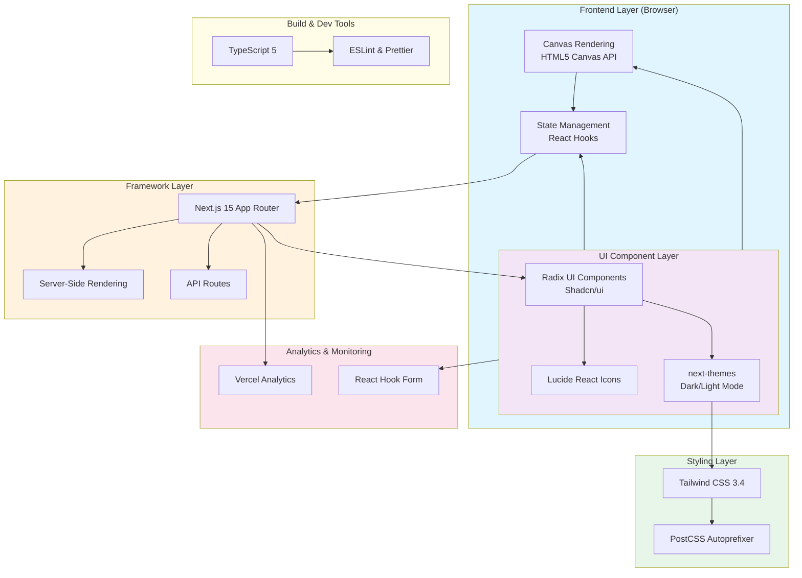

# Microsoft Paint

> A modern, web-based painting application built with Next.js 15 and React 19

[](https://vercel.com/gileb64375-5584s-projects/v0-microsoft-paint)
[](https://v0.app/chat/projects/PCWfnEoQn33)
[](https://nextjs.org)
[](https://react.dev)
[](https://www.typescriptlang.org)
[](https://tailwindcss.com)

---

## Table of Contents

- [Overview](#overview)
- [Features](#features)
- [System Architecture](#system-architecture)
- [Tech Stack](#tech-stack)
- [Getting Started](#getting-started)
- [Configuration](#configuration)
- [Project Stats](#project-stats)
- [Deployment](#deployment)
- [Contributing](#contributing)
- [License](#license)

---

## Overview

**Microsoft Paint** is a feature-rich web application that replicates the classic Windows Paint experience with modern enhancements. Built using **Next.js 15** and **React 19**, it provides a seamless drawing experience in the browser with a familiar interface.

### Key Highlights

- ✅ Modern web-based painting tool
- ✅ Responsive design with dark/light theme support
- ✅ Built with cutting-edge technologies
- ✅ Auto-synced with v0.app deployments

---

## Features

### 🎨 Core Drawing Tools

- **Pencil Tool** - Freehand drawing with customizable brush sizes
- **Brush Tool** - Soft brush strokes for artistic effects
- **Eraser Tool** - Remove unwanted parts of your artwork
- **Color Picker** - Full color palette with eyedropper functionality

### 🖼️ Canvas Operations

- **Resize Canvas** - Adjust canvas dimensions freely
- **Clear Canvas** - Start fresh with a single click
- **Undo/Redo** - Step through your drawing history
- **Zoom Controls** - Zoom in/out for detailed work

### 🎯 Additional Features

- **Shape Tools** - Draw rectangles, circles, and lines
- **Text Tool** - Add text annotations to your artwork
- **Fill Tool** - Flood fill with selected colors
- **Keyboard Shortcuts** - Efficient workflow with hotkeys

### 🔧 Advanced Capabilities

- **Drag & Drop** - Move elements around the canvas
- **Layer Management** - Work with multiple layers
- **Export Options** - Save your work in multiple formats
- **Touch Support** - Draw with stylus or finger on tablets

---

## System Architecture



### Architecture Breakdown

| Layer | Technology | Purpose |
|-------|------------|---------|
| **Frontend** | React 19 | UI rendering and state management |
| **Framework** | Next.js 15 | Routing, SSR, API routes |
| **Styling** | Tailwind CSS | Responsive, utility-first styling |
| **Components** | Radix UI + Shadcn/ui | Accessible, pre-built components |
| **Icons** | Lucide React | Lightweight SVG icons |

---

## Tech Stack

### Core Technologies

| Technology | Version | Purpose |
|------------|---------|---------|
| **Next.js** | 15.2.4 | React framework with App Router |
| **React** | 19 | UI library with hooks |
| **TypeScript** | 5.x | Type-safe JavaScript |
| **Tailwind CSS** | 3.4.17 | Utility-first CSS framework |

### UI Components & Libraries

| Package | Version | Purpose |
|---------|---------|---------|
| **@radix-ui/** | 1.x | Headless UI components |
| **shadcn/ui** | Latest | Pre-built component library |
| **lucide-react** | 0.454.0 | Icon library |
| **next-themes** | 0.4.4 | Theme management |
| **recharts** | 2.15.0 | Data visualization |

### Form & State Management

| Package | Version | Purpose |
|---------|---------|---------|
| **react-hook-form** | 7.54.1 | Form handling |
| **@hookform/resolvers** | 3.9.1 | Form validation |
| **zod** | 3.24.1 | Schema validation |

### Development & Analytics

| Package | Version | Purpose |
|---------|---------|---------|
| **@vercel/analytics** | 1.3.1 | Analytics tracking |
| **date-fns** | 4.1.0 | Date utilities |
| **class-variance-authority** | 0.7.1 | Class variance utility |
| **tailwind-merge** | 2.5.5 | Tailwind class merging |

### Dev Dependencies

| Package | Version | Purpose |
|---------|---------|---------|
| **typescript** | 5.x | TypeScript compiler |
| **@types/node** | 22 | Node.js types |
| **@types/react** | 19 | React types |
| **postcss** | 8.5 | CSS processor |
| **autoprefixer** | 10.4.20 | Vendor prefixes |

---

## Getting Started

### Prerequisites

> **Required:** Node.js 18.17 or later

Check your Node version:
```bash
node --version
```

### Installation

1. **Clone the repository**
```bash
git clone https://github.com/your-repo/microsoft-paint.git
cd microsoft-paint
```

2. **Install dependencies**
```bash
npm install
# or
pnpm install
# or
yarn install
```

3. **Start development server**
```bash
npm run dev
```

4. **Open in browser**
Navigate to: [http://localhost:3000](http://localhost:3000)

### Build for Production

```bash
npm run build
npm start
```

---

## Configuration

### Environment Variables

Create a `.env.local` file (optional):

```env
# Vercel Analytics
NEXT_PUBLIC_VERCEL_ANALYTICS_ID=your-analytics-id

# Analytics (optional)
ANALYTICS_ID=your-analytics-id
```

### Tailwind Configuration

The project uses **Tailwind CSS 3.4** with the following customizations:

- **Dark Mode**: Enabled via CSS class strategy
- **Custom Colors**: Full color palette including sidebar, chart colors
- **Animations**: Accordion animations
- **Plugins**: tailwindcss-animate

### TypeScript Configuration

Located in `tsconfig.json`:
- Strict mode enabled
- Path aliases configured for clean imports
- Next.js plugin integrated

### Project Structure

```
microsoft-paint/
├── app/                    # Next.js App Router
│   ├── layout.tsx         # Root layout
│   └── page.tsx          # Main page
├── components/
│   ├── ui/               # shadcn/ui components
│   └── theme-provider.tsx
├── lib/
│   └── utils.ts          # Utility functions
├── public/               # Static assets
├── package.json          # Dependencies
├── tailwind.config.ts    # Tailwind configuration
├── tsconfig.json         # TypeScript config
└── postcss.config.js     # PostCSS config
```

---

## Project Stats

### 📊 Repository Statistics

| Metric | Count |
|--------|-------|
| **Total Dependencies** | 60+ packages |
| **Production Dependencies** | 44 packages |
| **Development Dependencies** | 7 packages |
| **UI Components (Radix)** | 30+ components |
| **Source Files** | ~15 files |

### 📈 Bundle Insights

- **Framework**: Next.js 15 (App Router)
- **Styling**: Tailwind CSS with CSS variables
- **Icons**: Lucide React (~400+ icons)
- **Components**: Fully accessible Radix primitives

### 🔢 Dependency Breakdown

```
dependencies/
├── @radix-ui/*        → 30+ UI components
├── @vercel/analytics  → 1 package
├── react-*            → 4 packages
├── tailwind-*         → 4 packages
├── lucide-react       → 1 package (400+ icons)
└── ...other          → 10+ utilities
```

---

## Deployment

### Live Demo

🔗 **Production URL**: [https://vercel.com/gileb64375-5584s-projects/v0-microsoft-paint](https://vercel.com/gileb64375-5584s-projects/v0-microsoft-paint)

### Vercel Deployment

1. Push your code to GitHub
2. Import project in Vercel
3. Configure build settings:
   - Build Command: `npm run build`
   - Output Directory: `.next`
   - Install Command: `npm install`

### Automatic Deployment

> This repository auto-syncs with **v0.app** deployments. Any changes made in v0 will be automatically pushed here.

---

## Contributing

Contributions are welcome! Please follow these steps:

1. **Fork** the repository
2. Create a **feature branch** (`git checkout -b feature/amazing-feature`)
3. **Commit** your changes (`git commit -m 'Add amazing feature'`)
4. **Push** to the branch (`git push origin feature/amazing-feature`)
5. Open a **Pull Request**

---

## License

This project is licensed under the **MIT License** - see the [LICENSE](LICENSE) file for details.

---

## Acknowledgments

- Built with [v0.app](https://v0.app) by Vercel
- UI components from [shadcn/ui](https://ui.shadcn.com)
- Icons from [Lucide](https://lucide.dev)

---

<p align="center">
  <strong>Made with ❤️ using Next.js + React</strong>
</p>